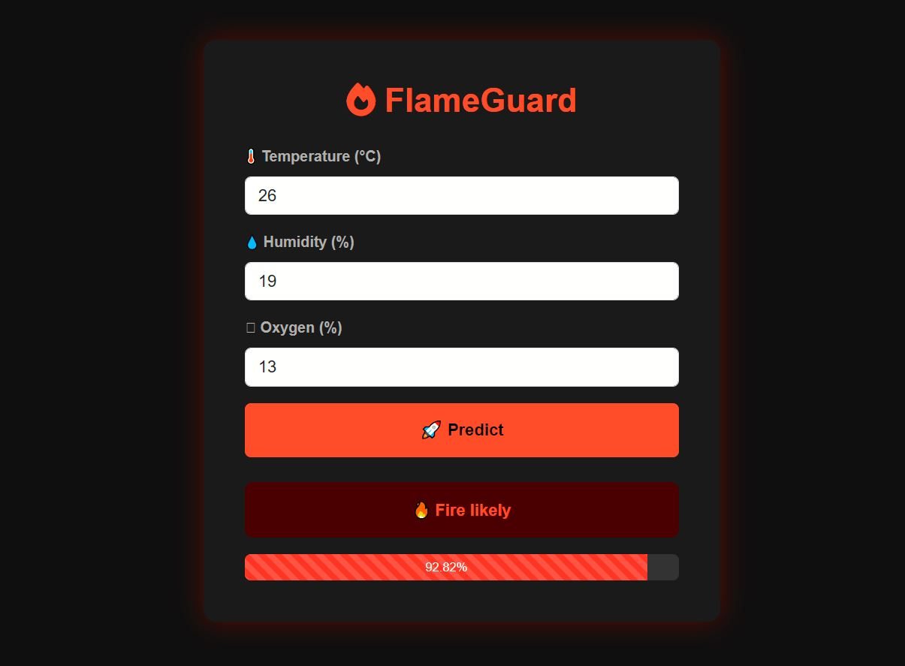

# Fire Risk Predictor: Using AI to Predict Forest Fire Risks


## Introduction

Forest fires are among the most destructive natural disasters worldwide. They pose significant threats to human life, wildlife, forests, and the environment. Fires can spread rapidly, often fueled by high temperatures, dry weather, and oxygen-rich surroundings. Traditional monitoring methods such as satellite imagery, human patrolling, and historical data analysis are often reactive, slow, and sometimes prone to errors.

The **Fire Risk Predictor (FlameGuard)** is a web-based application designed to predict fire risk in real-time using **environmental parameters** like temperature, humidity, and oxygen levels. By integrating **machine learning algorithms** with an intuitive web interface, the project aims to provide actionable insights for individuals, authorities, and forest management teams.  

This README serves as both documentation and a detailed guide, covering the project's background, methodology, usage, and future possibilities.

## Background and Necessity

Fires can devastate ecosystems, destroy property, and endanger human lives. Climate change has increased the frequency and intensity of wildfires worldwide. Early detection and proactive measures are crucial to minimizing their impact.  

Traditional methods have limitations:

- **Human Patrolling:** Limited coverage and dependent on human observation  
- **Satellite Monitoring:** Often delayed and lacks granular data  
- **Reactive Measures:** Fire response often happens after ignition  

**Why FlameGuard is necessary:**  

1. **Early Detection:** Predict potential fire-prone areas before fires occur  
2. **Resource Optimization:** Allocate firefighting resources more efficiently  
3. **Public Safety:** Alert communities in time for evacuation or safety measures  
4. **Environmental Protection:** Preserve forests and wildlife from damage  

By predicting fire risk in advance, FlameGuard bridges the gap between raw environmental data and actionable prevention strategies.  

## Purpose of the Project

The primary purpose of FlameGuard is to develop a **reliable, accessible tool** that can predict the likelihood of fire incidents based on environmental conditions.  

Key goals:

- Provide early warning of fire-prone conditions  
- Enable users to make informed decisions based on predictive analysis  
- Support forest management authorities with **data-driven insights**  
- Offer a **simple web interface** for inputting environmental data and receiving predictions  

## Features

FlameGuard has been designed with usability, accuracy, and accessibility in mind:

1. **Input Fields:** Users can input:
   - Temperature (°C)  
   - Humidity (%)  
   - Oxygen (%)  

2. **Predictive Algorithm:**  
   - Machine learning model evaluates the risk of fire  
   - Uses historical data from `forestfire.csv` for accurate predictions  

3. **Confidence Indicator:**  
   - Displays the probability of fire occurrence  
   - Helps users assess reliability of the prediction  

4. **Responsive Web Interface:**  
   - Built using **Bootstrap** for responsive design  
   - Dark theme for improved readability  
   - Works across desktop, tablet, and mobile  

5. **Secure User Sessions:**  
   - Login/Register functionality  
   - Logout button fixed at the top-right corner for easy access  

## Technologies Used

**Frontend:** HTML, CSS, Bootstrap, JavaScript  
- Provides a clean, responsive, and interactive user interface  

**Backend:** Python, Flask  
- Handles data processing, routing, and integration with the machine learning model  

**Machine Learning:** Python libraries (scikit-learn, pandas, NumPy)  
- Data preprocessing, training predictive models, and generating fire risk predictions  

**Version Control:** Git  
- Enables code versioning and collaborative development  

## Methodology

FlameGuard’s development involves several systematic steps:

### 1. Data Collection

The dataset `forestfire.csv` contains historical fire incidents and environmental parameters:

- Temperature (°C)  
- Humidity (%)  
- Oxygen (%)  
- Fire occurrence (Yes/No)  

This dataset provides the foundation for model training and prediction.

### 2. Data Preprocessing

Preprocessing ensures data quality and enhances model performance:

- **Cleaning:** Remove missing, inconsistent, or erroneous data  
- **Normalization:** Scale input values for consistent model performance  
- **Feature Selection:** Identify parameters most relevant to fire risk prediction  

**Example:**  
```python
from sklearn.preprocessing import StandardScaler
scaler = StandardScaler()
X_scaled = scaler.fit_transform(X)
```

### 3. Model Training

The system uses machine learning algorithms to predict fire risk:

- **Decision Trees:** Provide clear rules for prediction  
- **Random Forests:** Ensemble method improving accuracy  
- **Logistic Regression:** Offers probability-based predictions  

The model is trained using historical data and validated with test sets to ensure accuracy.

**Training Script Example:**  
```python
from sklearn.ensemble import RandomForestClassifier

model = RandomForestClassifier(n_estimators=100, random_state=42)
model.fit(X_train, y_train)
```

### 4. Web Application Integration

Flask handles backend operations:

- Routes user requests (`/predict`)  
- Validates inputs (temperature, humidity, oxygen)  
- Sends data to the trained model  
- Returns prediction with confidence score  

**Example Endpoint:**  
```python
@app.route('/predict', methods=['POST'])
def predict():
    data = request.get_json()
    prediction = model.predict([data['temp'], data['humidity'], data['oxygen']])
    confidence = model.predict_proba([data['temp'], data['humidity'], data['oxygen']])
    return jsonify({'prediction': prediction[0], 'confidence': confidence[0][1]*100})
```

### 5. Deployment

Deployment steps:

1. Install dependencies: `pip install -r requirements.txt`  
2. Run Flask app: `flask run`  
3. Access application in the browser  
4. Input environmental data or upload a CSV for batch predictions  
5. View prediction results and confidence bar  

## Project Structure

```
flameguard_project/
│
├── templates/
│ ├── index.html
│ ├── login.html
│ └── register.html
│
├── static/
│ └── styles.css
│
├── forestfire.csv
├── app.py
├── auth.py
├── database.py
├── train_model.py
├── processingData.ipynb
├── requirements.txt
└── README.md
```

**Explanation:**  
- `templates/` → HTML pages for rendering content  
- `static/` → CSS and assets  
- `forestfire.csv` → Dataset for model training  
- `app.py` → Main Flask application  
- `auth.py` → User authentication  
- `database.py` → Manages data storage  
- `train_model.py` → Script for training ML models  
- `processingData.ipynb` → Data preprocessing and exploration  

## Installation & Setup

### 1. Clone the Repository
```bash
git clone https://github.com/shiraz768/flameguard
cd flameguard
```

### 2. Create a Virtual Environment
```bash
# For Windows
python -m venv venv
venv\Scripts\activate

# For Mac/Linux
python3 -m venv venv
source venv/bin/activate
```

### 3. Install Required Packages
```bash
pip install -r requirements.txt
```

### 4. Build the model
```bash
python train_model.py
```

### 5. Run the app
```bash
python app.py
```

## Usage Guide

1. Open the web application in a browser.  
2. Login or register if needed.  
3. Enter temperature, humidity, and oxygen levels.  
4. Click **Predict** to view the fire risk and confidence.  
5. Logout using the top-right button to end the session.  

  

## Example Predictions

| Temperature (°C) | Humidity (%) | Oxygen (%) | Prediction | Confidence |
|-----------------|-------------|------------|-----------|------------|
| 35              | 20          | 21         | Fire Risk | 85%        |
| 28              | 60          | 19         | Safe      | 90%        |
| 40              | 15          | 22         | Fire Risk | 92%        |

## Future Enhancements

- **Real-time Sensor Integration:** Continuous monitoring of forests  
- **Email/SMS Alerts:** Immediate notifications for high-risk conditions  
- **Advanced Models:** Deep learning for higher accuracy  
- **Visualizations:** Charts showing historical fire trends  
- **Mobile App Integration:** Access predictions on-the-go  
- **Cloud Deployment:** Scalable and multi-location access  

## Importance and Impact

FlameGuard provides numerous benefits:

- **Proactive Fire Management:** Early identification of fire-prone areas  
- **Public Safety:** Reduces risk to human lives  
- **Environmental Protection:** Preserves forests and wildlife  
- **Data-Driven Decisions:** Optimizes firefighting resources  

The project demonstrates the **power of AI** in solving real-world problems, combining **data science, machine learning, and web development** for practical outcomes.

## Conclusion

The **Fire Risk Predictor (FlameGuard)** shows how AI can enhance disaster management. By combining predictive modeling with an easy-to-use interface, it enables timely and informed action against forest fires. Future improvements like real-time monitoring, mobile apps, and advanced ML models will make FlameGuard even more impactful.

## Contact

For questions or collaboration:  
**Syed Shiraz Haidar** – hshiraz649@gmail.com  
